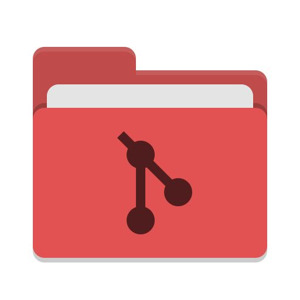
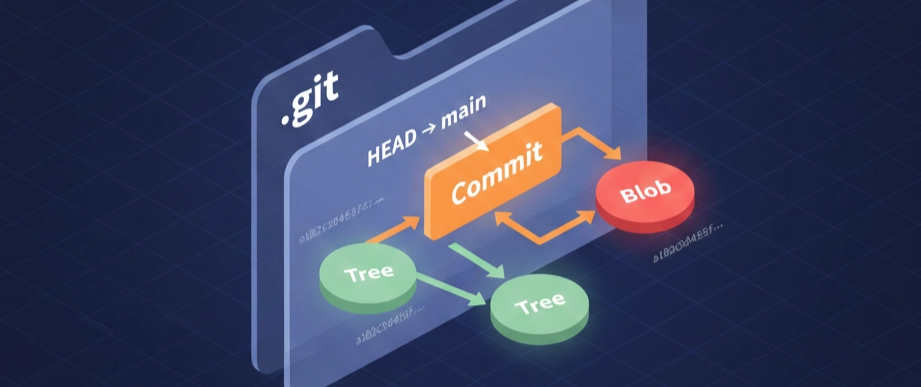
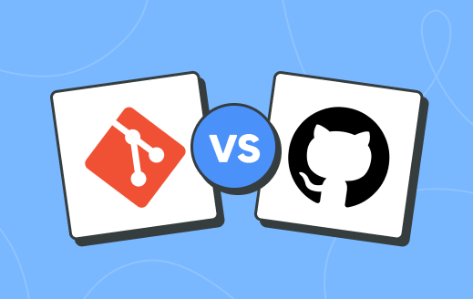
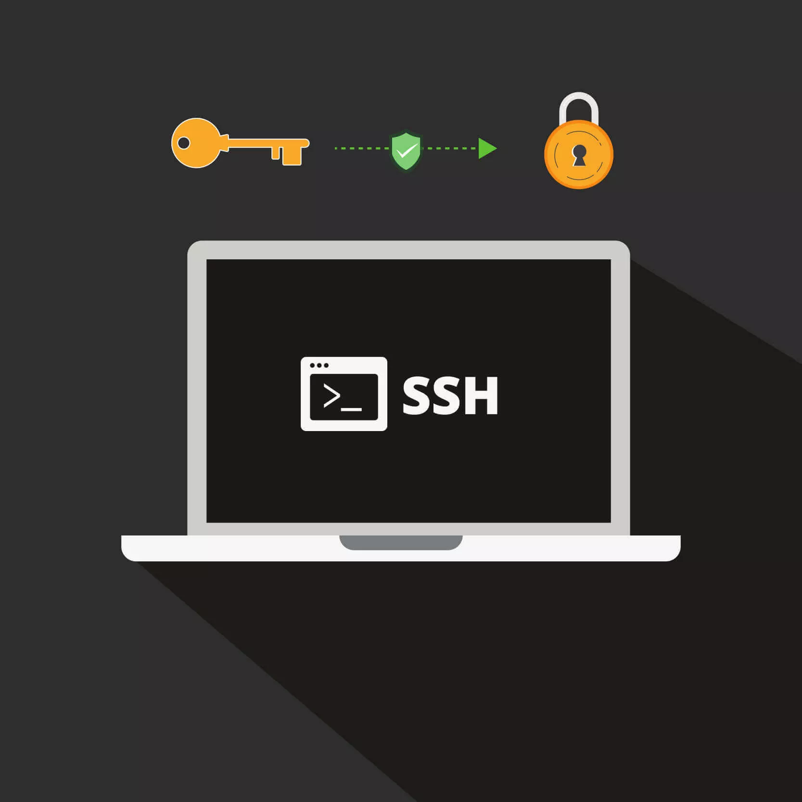
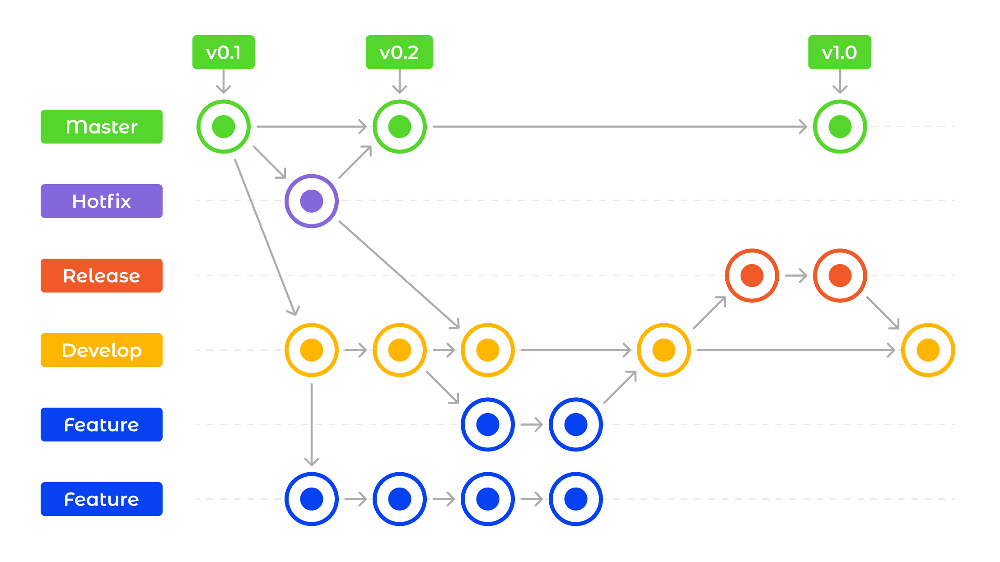

# GIT

**Nombre:** Adalia Flores Escobar  
---
**Clase:** CLASE 1  
---

## ¿Qué es Git?

Git es un sistema de control de versiones distribuido que permite registrar y gestionar cambios en archivos a lo largo del tiempo.

Funciona como un sistema de "checkpoints", permitiendo volver a versiones anteriores del proyecto cuando sea necesario.

---

## Ventajas de Git
- Permite volver a versiones anteriores en caso de errores.
- Mantiene un historial completo de cambios.
- Facilita el trabajo colaborativo.
- Cada usuario tiene una copia completa del repositorio.

---

## Origen de Git
Git fue creado por Linus Torvalds en 2005.


Antes, el desarrollo del kernel de Linux se gestionaba mediante correos electrónicos. Luego se utilizó una herramienta llamada BitKeeper, pero debido a restricciones en su uso, se dejó de utilizar.

Como solución, Linus Torvalds desarrolló Git en pocas semanas, priorizando velocidad, seguridad y trabajo distribuido.

---

## Instalación en Linux

Verificar si Git está instalado:
```bash
git --version
```
---

# CLASE 2 - STATES Y COMMITS

---

## Estados de Git

Git maneja tres áreas principales:

### 1. DIRECTORIO DE TRABAJO (Working Directory)


Es donde estás trabajando directamente con tus archivos.

- Detecta cambios que haces en los archivos.

#### Estados dentro del directorio:

- **untracked**: Archivo nuevo que Git detecta pero aún no tiene versión previa.

- **modified**: Archivo que ya existe en Git pero ha sido modificado, eliminado o renombrado.

📌 **Nota:**  
Cualquier archivo que no esté en `.gitignore` entra automáticamente en estos estados.

---

### Ver estado de los archivos

```bash
git status
```

### Restaurar archivos

```bash
git restore nombreArchivo
```

⚠️ Elimina los cambios actuales (usar con cuidado).

### Archivo .gitignore

Crear archivo:

```bash
touch .gitignore
```

Editar:

```bash
nano .gitignore
```

**Función:** Indicar qué archivos o carpetas Git debe ignorar.

Ejemplo:
node_modules/
.env
*.log

---

### 2. STAGE AREA (Área de preparación)


Es donde seleccionas los archivos que quieres incluir en el próximo commit.

#### Agregar archivos al stage

```bash
git add nombreArchivo
```

#### Agregar todo:

```bash
git add .
```

#### Quitar archivos del stage

```bash
git restore --staged nombreArchivo
```

- Saca el archivo del área de preparación.
- Vuelve al estado `modified`.
- ❗ No elimina los cambios, solo los deselecciona.

---

### 3. REPOSITORIO LOCAL (Commits)


Aquí se guardan los cambios confirmados con un identificador único (ID).

#### Crear un commit

```bash
git commit -m "mensaje descriptivo"
```

Guarda todos los archivos del stage en el historial.

#### Volver al estado anterior (manteniendo cambios)

```bash
git reset --soft HEAD~1
```

Regresa el último commit al stage.

#### Modificar el último commit

```bash
git commit --amend -m "Nuevo mensaje"
```

Cambia el mensaje del último commit.

---

### Buenas prácticas en commits

#### ¿Cada cuánto hacer commits?

- Haz commits pequeños y frecuentes.
- Cada commit debe representar una tarea completa y significativa.

#### Cómo escribir buenos commits

✔ Usa verbos en imperativo:

- `add` → añadir
- `change` → modificar
- `fix` → corregir errores
- `remove` → eliminar

❌ Evita:

- Puntos finales (`.`)
- Puntos suspensivos (`...`)

Ejemplos:

```bash
git commit -m "Add new search feature"   ✔
git commit -m "Fix topbar bug"           ✔
git commit -m "Add new feature."         ✘
```

#### Longitud del mensaje

- Máximo recomendado: 50 caracteres
- Claro y conciso

#### Uso de prefijos en commits

Formato:

```bash
git commit -m "<tipo>: <descripción>"
```

Ejemplo:

```bash
git commit -m "feat: add search feature"
```

#### Prefijos más usados

| Prefijo | Uso |
|---------|-----|
| `feat:` | nueva funcionalidad |
| `fix:` | corrección de errores |
| `perf:` | mejora de rendimiento |
| `build:` | cambios en build o despliegue |
| `ci:` | integración continua |
| `docs:` | documentación |
| `refactor:` | refactorización |
| `style:` | formato (no afecta funcionalidad) |
| `test:` | pruebas |

Ejemplo:

```bash
git commit -m "docs: add fruits list to README"
```

#### Añadir más contexto al commit

Si necesitas explicar más:

```bash
git commit
```

Esto abre el editor. 

Ejemplo:
feat: add login system
Se implementa autenticación con JWT
y validación de credenciales

- Primera línea → título
- Siguientes líneas → descripción detallada

#### Ver historial de commits

Para verlo de manera resumida:

```bash
git log --online
```
#### Tamaño maximo que puedes subir a Github

Lo maximo que puedes subir es 100 MB

---

# CLASE 3 - GITHUB Y SSH


---

## ¿Qué es GitHub?

GitHub es una plataforma en la nube y red social para desarrolladores que permite alojar, gestionar y colaborar en proyectos de software utilizando Git.

---

## Git vs GitHub


| | Git | GitHub |
|---|---|---|
| **Qué es** | Sistema de control de versiones local | Plataforma en la nube |
| **Función** | Crea los "puntos de guardado" (commits) | Almacena y comparte esos commits |
| **Dónde vive** | En tu computadora | En internet |

> GitHub **usa** Git, pero no son lo mismo. Git puede existir sin GitHub, pero GitHub no existiría sin Git.

---

## SSH vs HTTPS

### HTTPS


Al clonar y usar un repositorio con HTTPS, GitHub te pedirá autenticarte **cada vez** que hagas un `push` o `pull`, incluyendo el uso de tokens de acceso personal. Esto puede volverse tedioso en el día a día.

### SSH



Con SSH configuras un par de claves criptográficas en tu máquina. Le entregas tu **clave pública** a GitHub, y desde ese momento tu computadora se autentica automáticamente sin necesidad de ingresar credenciales.

> 💡 **Recomendación:** Usa siempre SSH para trabajar con GitHub de forma más cómoda y segura.

---

## Configuración SSH

Ejecuta los siguientes comandos desde tu terminal (Linux/Mac) o Git Bash (Windows):

### 1. Generar el par de claves SSH

```bash
ssh-keygen -t ed25519 -C "tu-correo@email.com"
```

- `-t ed25519` → tipo de algoritmo de cifrado (el más moderno y seguro)
- `-C` → comentario para identificar la clave (usa el correo asociado a GitHub)

Cuando te pregunte dónde guardar la clave, presiona **Enter** para usar la ubicación por defecto (`~/.ssh/id_ed25519`).

### 2. Copiar la clave pública

```bash
cat ~/.ssh/id_ed25519.pub
```

Copia todo el contenido que aparece. Luego ve a **GitHub → Settings → SSH and GPG keys → New SSH key** y pégala.

### 3. Verificar la conexión

```bash
ssh -T git@github.com
```

Si todo salió bien, verás un mensaje como:
Hi TuUsuario! You've successfully authenticated...

---

## Crear un repositorio en GitHub

1. Ve a tu sección de repositorios: `https://github.com/TuUsuario?tab=repositories`
2. Haz clic en **"New"**
3. Escribe el nombre del repositorio y, opcionalmente, una descripción
4. Haz clic en **"Create repository"**

---

## Conectar un repositorio local con GitHub

> ⚠️ **Requisito previo:** ya debes haber ejecutado `git init` y tener al menos un commit (`git add . + git commit -m "Initial commit"`).

### 1. Vincular el repositorio remoto

```bash
git remote add origin git@github.com:TuUsuario/TuRepo.git
```

- `remote` → URL que apunta a tu repositorio en GitHub
- `origin` → apodo (alias) que Git le da por defecto a esa URL. Puedes cambiarlo, pero `origin` es la convención universal

### 2. Renombrar la rama principal a `main`

```bash
git branch -M main
```

Cambia el nombre de la rama por defecto de `master` a `main` (estándar actual de GitHub).

### 3. Subir los commits a GitHub

```bash
git push -u origin main
```

- `-u` → establece `origin main` como destino por defecto, así en el futuro solo necesitas escribir `git push`

---

## Clonar un repositorio de GitHub

```bash
git clone git@github.com:TuUsuario/TuRepo.git
```

### Si lo clonaste por error con HTTPS

Usa este comando para cambiar la URL remota a SSH y evitar autenticarte en cada operación:

```bash
git remote set-url origin git@github.com:TuUsuario/TuRepo.git
```

> 💡 Este mismo comando sirve también si quieres **cambiar el repositorio remoto** al que está conectado tu proyecto.

### Ver a qué repositorio remoto estás conectado

```bash
git remote -v
```

---

## Subir y bajar cambios

### Subir cambios → `git push`

```bash
git push origin <rama>
```

| Parte | Significado |
|---|---|
| `git push` | "Empuja" tus commits hacia el servidor |
| `origin` | El servidor remoto (GitHub) |
| `<rama>` | La rama que quieres subir (ej: `main`) |

### Bajar cambios → `git pull`

```bash
git pull origin <rama>
```

| Parte | Significado |
|---|---|
| `git pull` | "Trae" los commits del servidor a tu máquina |
| `origin` | El servidor remoto (GitHub) |
| `<rama>` | La rama de la que quieres traer cambios |

> 💡 `git pull` es equivalente a hacer `git fetch` + `git merge` en un solo paso.

---
# CLASE 4 - REMOTE, SSH MÚLTIPLE Y CHECKOUT

---

## Git Remote


`git remote` es el comando que gestiona las conexiones con repositorios remotos. Le dice a Git local **dónde enviar** o **de dónde traer** información.

### Comandos útiles

| Comando | Descripción |
|---|---|
| `git remote -v` | Muestra las URLs exactas a donde apunta tu repositorio |
| `git remote add <apodo> <url>` | Vincula tu repo local con uno en la nube |
| `git remote set-url <apodo> <url>` | Cambia la URL a donde apunta tu repositorio |

---

## SSH Múltiple

### ¿Por qué necesitarías múltiples llaves SSH?

Si tienes **más de una cuenta de GitHub** (por ejemplo, una personal y una del trabajo), cada cuenta necesita su propia llave SSH.

Recuerda que una llave SSH es como un **túnel seguro** entre tu computadora y GitHub. El problema es que si usas la misma llave para dos cuentas distintas, GitHub no sabe cuál cuenta eres tú en cada momento — y los túneles chocan.

> 🔑 **Analogía:** Es como tener dos casas con dos cerraduras distintas. Una llave abre tu casa, la otra abre la del trabajo. No querrías que la misma llave abriera ambas puertas.

La solución es crear **una llave SSH por cuenta** y decirle a Git cuál llave usar para cada una mediante un archivo de configuración.

---

## Configurar SSH Múltiple

### Paso 1 — Generar la nueva llave SSH

Ya tienes una llave para tu cuenta principal (`~/.ssh/id_ed25519`). Ahora generamos una segunda llave con un nombre diferente usando el flag `-f`:

```bash
ssh-keygen -t ed25519 -C "micorreo@gmail.com" -f ~/.ssh/id_miname
```

- `-f ~/.ssh/id_miname` → define el nombre y ubicación del archivo de la nueva llave

Esto crea dos archivos:
- `~/.ssh/id_miname` → llave **privada** (nunca la compartas)
- `~/.ssh/id_miname.pub` → llave **pública** (esta la pegas en GitHub)

> Recuerda agregar la llave pública (`id_miname.pub`) a la cuenta secundaria en **GitHub → Settings → SSH Keys**.

---

### Paso 2 — Crear el archivo de configuración SSH

Este es el paso clave. Creamos (o editamos) el archivo `~/.ssh/config` para decirle a SSH **qué llave usar según el destino**:

```bash
nano ~/.ssh/config
```
Ejemplo:

```
# Cuenta principal (la de siempre)
Host github.com
  HostName github.com
  User git
  IdentityFile ~/.ssh/id_ed25519

# Cuenta secundaria
Host github-miname
  HostName github.com
  User git
  IdentityFile ~/.ssh/id_miname
```

**¿Qué significa cada línea?**

| Campo | Significado |
|---|---|
| `Host` | El **apodo o alias** de la conexión. Es lo que escribes en la terminal después de `git@`. Para la cuenta principal usas `github.com`; para la secundaria inventas un alias como `github-miname` |
| `HostName` | La dirección real del servidor. Siempre será `github.com` para ambas cuentas |
| `User` | El usuario del sistema remoto. Para GitHub **siempre es `git`**, sin excepción |
| `IdentityFile` | La ruta a la llave privada que se usará para ese `Host` |

> 💡 El `Host` es solo un apodo. Tanto `github.com` como `github-miname` se conectan al mismo servidor (`github.com`), pero con **llaves distintas**. Al cambiar el apodo, SSH sabe qué llave usar.

---

### Paso 3 — Verificar que funciona
Para verificar si funciona ejecutamos el comando:
```bash
ssh -T git@github.com        # verifica cuenta principal
ssh -T git@github-miname     # verifica cuenta secundaria
```

Si todo está bien, verás un mensaje como:
```
Hi TuUsuario! You've successfully authenticated...
```

---

### Paso 4 — Clonar o conectar repositorios con el host correcto

> ⚠️ **Esto es lo que más se olvida.** Al clonar o vincular un repositorio de la cuenta secundaria, debes usar el **apodo del Host**, no `github.com` directamente.

Clonar un repo de la cuenta secundaria:

```bash
# ✅ Correcto — usa el alias del Host
git clone git@github-miname:usuario/repo.git

# ❌ Incorrecto — SSH no sabe qué llave usar
git clone git@github.com:usuario/repo.git
```

Si ya tienes un repositorio conectado y quieres cambiarlo a la cuenta secundaria:

```bash
git remote set-url origin git@github-miname:usuario/repo.git
```

---

## Configuraciones locales por repositorio

Las configuraciones locales se aplican **solo al repositorio actual** y tienen prioridad sobre las globales.

```bash
# Configuración LOCAL (solo este repo)
git config user.name "Mi Nombre"
git config user.email "micorreo@gmail.com"

# Configuración GLOBAL (todos los repos)
git config --global user.name "Mi Nombre"
git config --global user.email "micorreo@gmail.com"
```

> 💡 Esto es muy útil con múltiples cuentas: configuras el email de trabajo en los repos del trabajo, y el personal en los tuyos, sin que interfieran.

---

## Git Checkout

`git checkout` mueve el **HEAD** (el puntero que indica en qué punto de la historia estás) hacia un commit específico o hacia otra rama.

### ¿Para qué sirve?

| Uso | Descripción |
|---|---|
| **Inspeccionar** | Ver cómo era el código en un commit antiguo |
| **Restaurar** | Recuperar archivos que borraste o modificaste |
| **Experimentar** | Probar cambios sin afectar la rama principal |
| **Cambiar de rama** | Moverte entre ramas (ej: de `main` a `desarrollo`) |

---

## El estado "Detached HEAD"

Normalmente el HEAD apunta a una **rama** (que avanza con cada commit). Cuando haces checkout a un commit antiguo, el HEAD apunta directamente a ese **commit fijo** — sin rama. A esto se le llama estado *detached HEAD* (cabeza desacoplada).

> 🎬 **Analogía:** Es como viajar al pasado. Puedes ver todo lo que había, incluso tomar notas, pero si te vas sin "encarnar" en una rama, todo lo que escribiste desaparece al volver al presente.

### Ir a un commit antiguo y volver

```bash
# Viajar a un commit específico (entras en detached HEAD)
git checkout <hash_del_commit>

# Volver al presente (a tu rama principal)
git checkout <rama>
```

### ¿Qué pasa si hiciste commits en detached HEAD?

Esos commits no pertenecen a ninguna rama y Git los descartará eventualmente. Para no perderlos, crea una rama antes de salir:

```bash
git checkout <hash_del_commit_creado>
git checkout -b rama_nueva
```

---

## Buenas prácticas con checkout

**1. No trabajes mucho tiempo en Detached HEAD**  
Si vas a escribir más de un par de líneas de código, crea una rama de una vez con `git checkout -b nombre-rama`.

**2. Limpia tu directorio de trabajo antes de viajar**  
Haz commit (o guarda con `git stash`) de lo que estás haciendo antes de hacer checkout a otro punto. Si tienes cambios sin guardar, Git puede negarse a dejarte viajar para no perderlos.

**3. Úsalo para aprender**  
Hacer checkout a commits antiguos de proyectos grandes es una excelente forma de entender cómo evolucionó el código con el tiempo.

---
# CLASE 5 - RAMAS Y GITFLOW BÁSICO

---

## ¿Qué son las ramas?


Una rama es una **bifurcación del código** que permite crear un camino paralelo de desarrollo. Esto es especialmente útil para que varios desarrolladores trabajen al mismo tiempo sin pisarse el código entre sí.

> 💡 Imagina que el proyecto es una línea de tiempo. Una rama es como crear una línea de tiempo alternativa donde puedes experimentar y desarrollar, sin afectar la línea principal.

---

## Git Branch

`git branch` es el comando para gestionar las ramas del proyecto.

```bash
# Ver todas las ramas (marca con * la rama actual)
git branch

# Crear una rama nueva desde la rama actual
git branch <nombre-rama>

# Eliminar una rama
git branch -D <nombre-rama>
```

---

## Cambiar de rama: checkout vs switch

### git checkout (clásico)

```bash
# Cambiar a una rama existente
git checkout <rama>

# Crear una rama y moverse a ella directamente
git checkout -b <rama>
```

### git switch 

```bash
# Cambiar a una rama existente
git switch <rama>

# Crear una rama y moverse a ella directamente
git switch -c <rama>
```

### ¿Cuál usar?

| | `git checkout` | `git switch` |
|---|---|---|
| **Cambiar de rama** | ✅ | ✅ |
| **Crear y cambiar de rama** | ✅ `-b` | ✅ `-c` |
| **Viajar a commits antiguos** | ✅ | ❌ |
| **Restaurar archivos** | ✅ | ❌ |
| **Riesgo de Detached HEAD** | ⚠️ Sí | ❌ No |

> 💡 `git checkout` es multiusos pero puede confundir. `git switch` hace una sola cosa y la hace bien. Para moverte entre ramas, ambos sirven — pero `git switch` es más seguro e intuitivo.

> ⚠️ Antes de cambiar de rama asegúrate de no tener archivos en estado `modified`, `untracked` o `staged`, o Git no te dejará cambiar.

---

## GitFlow básico



GitFlow es un **flujo de trabajo** que establece reglas claras sobre cómo nombrar y usar las ramas. Su objetivo es mantener el proyecto ordenado y que cualquier persona que se una pueda entender rápidamente el estado del código.

### Las ramas de GitFlow

#### `main`
- Contiene el código en **producción** (lo que los usuarios finales están usando).
- Solo recibe código probado y validado.
- Cada merge aquí debería representar una versión estable.

#### `develop`
- Es la rama de **pre-producción** y el día a día del equipo.
- Contiene funcionalidades ya desarrolladas pero que aún se están probando antes de pasar a `main`.
- Es la rama desde la que nacen la mayoría de las ramas de apoyo.

---

### Ramas de apoyo

#### `feature/*`
Para desarrollar **nuevas funcionalidades**.

- Nace de: `develop`
- Muere en: `develop`
- Convención de nombres:

```
feature/nombre-descriptivo-en-ingles
feature/add-search-bar
feature/new-user-form
feature/sum-function
```

#### `release/*`
Para preparar y probar el **lanzamiento de una nueva versión** (QA).

- Nace de: `develop`
- Muere en: `develop` y `main`
- Convención de nombres:

```
release/v1.0.0
release/v2.1.0-beta
```

#### `hotfix/*`
Para corregir **bugs urgentes en producción**. Nace directamente de `main` porque `develop` puede tener código inestable y no se puede esperar.

- Nace de: `main`
- Muere en: `main` y `develop`
- Convención de nombres:

```
hotfix/login-authentication-error
hotfix/fix-database-connection-leak
hotfix/security-patch-v1.0.2
```

---

### Resumen de GitFlow

| Rama | Nace de | Muere en | Propósito |
|---|---|---|---|
| `main` | — | Jamás (eterna) | Código en producción |
| `develop` | `main` | Jamás (eterna) | El día a día del equipo |
| `feature/*` | `develop` | `develop` | Desarrollar una funcionalidad |
| `release/*` | `develop` | `main` y `develop` | Preparar y probar una versión |
| `hotfix/*` | `main` | `main` y `develop` | Arreglar un bug urgente en producción |

---
# CLASE 6 - FETCH, PULL, MERGE Y CONFLICTOS

---

## Git Fetch

`git fetch` consulta el repositorio remoto y te **informa si hubo cambios** en la rama y sus ramas hijas, pero no los descarga ni los aplica. Es como asomarte a ver si hay correo nuevo sin abrirlo.

```bash
git fetch
```

> 💡 Úsalo antes de hacer `git pull` para saber qué cambios te esperan antes de aplicarlos.

---

## Git Pull

`git pull` **descarga y aplica** todos los cambios del repositorio remoto a tu rama local. Siempre úsalo especificando `origin` y el nombre de la rama para evitar problemas.

```bash
git pull origin <rama>
```

> ⚠️ Antes de fusionar ramas, siempre haz `git fetch` + `git pull` para asegurarte de que tienes el código más reciente.

---

## Git Push

`git push` **sube tus commits** al repositorio remoto.

```bash
git push origin <rama>
```

### Primera vez en un repositorio ajeno

Si el repositorio no es tuyo y es la primera vez que subes tu rama, usa el flag `-u` para que Git registre la rama remota y no pida permisos cada vez:

```bash
git push -u origin <rama>
```

---

## Git Merge

`git merge` **fusiona dos ramas** para que ambas compartan sus commits. Se ejecuta estando posicionado en la rama que va a *recibir* los cambios.

```bash
# Primero posiciónate en la rama destino
git checkout develop

# Luego fusiona la rama que quieres traer
git merge <rama>
```

#### Sin `--no-ff` (fast-forward)

Cuando `develop` no tuvo ningún commit mientras trabajabas en tu `feature`, Git dice: *"no hay nada que fusionar realmente, simplemente muevo el puntero"*. El resultado es que el historial queda como si nunca hubiera existido una rama separada:

```
develop ----A----B----C----D----E
                              ↑
                       (antes era feature)
```

Los commits D y E eran de `feature`, pero ahora parecen parte de `develop` directamente. **No hay rastro de que existió una rama.** A esto se le llama "aplanar" el historial.

### El flag `--no-ff` (recomendado)

`--no-ff` significa *no fast-forward*. Sin este flag, Git puede hacer una fusión silenciosa que no deja rastro en el historial. Con `--no-ff` se **fuerza la creación de un commit de merge**, preservando el historial de ramas aunque las elimines después.

```
develop ----A----B-----------M
                 \          /
feature           C----D----E
```

```bash
git merge --no-ff feature/header-landing
```

| | Sin `--no-ff` | Con `--no-ff` |
|---|---|---|
| **Historial** | Se aplana, se pierde el rastro | Se conserva la bifurcación |
| **Commit de merge** | No siempre se crea | Siempre se crea |
| **Recomendado en GitFlow** | ❌ | ✅ |

> 💡 Una vez que fusionas una rama y ya no harás más cambios en ella, puedes eliminarla con `git branch -D <rama>`.

---

## Conflictos

Un conflicto ocurre cuando **dos personas modificaron la misma parte del mismo archivo** y Git no sabe con cuál versión quedarse. En ese caso, Git pausa el merge y te pide que resuelvas el conflicto manualmente.

### ¿Cómo se ve un conflicto en el archivo?

```
<<<<<<< HEAD
// Tu código (donde tú estás)
=======
// El código que viene de la otra rama
>>>>>>> feature/header-landing
```

- Todo lo que está entre `<<<<<<< HEAD` y `=======` es **tu versión**
- Todo lo que está entre `=======` y `>>>>>>> feature/...` es **la versión que quieres fusionar**

### ¿Cómo resolverlo con nano?

1. Abre el archivo en conflicto:
```bash
nano <archivo-con-conflicto>
```

2. Edita manualmente el archivo: elimina las líneas `<<<<<<<`, `=======` y `>>>>>>>` y deja solo el código correcto (el tuyo, el de ellos, o una combinación de ambos).

3. Guarda y cierra nano:
```
Ctrl + O  →  Enter  →  Ctrl + X
```

4. Agrega el archivo resuelto al stage y confirma:
```bash
git add .
git commit
```

---

## Flujo de trabajo completo (sin Pull Requests)

Este es el flujo que seguirás en el día a día para fusionar tu rama de trabajo en `develop`:

```bash
# 1. Moverse a la rama destino
git checkout develop

# 2. Verificar si hay cambios remotos
git fetch

# 3. Traer los cambios más recientes
git pull origin develop

# 4. Fusionar tu rama de trabajo
git merge --no-ff <tu-rama>

# 5. Si hay conflictos, resolverlos manualmente en nano,
#    luego agregar los archivos resueltos
git add .

# 6. Confirmar el merge
git commit
# (en nano: Ctrl + O → Enter → Ctrl + X)

# 7. Eliminar la rama ya fusionada
git branch -D <tu-rama>

# 8. Subir los cambios a GitHub
git push origin develop
```

---
# CLASE 7 - PULL REQUESTS Y PROTECCIÓN DE RAMAS

---

## ¿Por qué no hacer merge directamente?

Hasta ahora confiábamos en que cada persona fusionara su propio código sin errores, pero esto es arriesgado en equipos reales porque:

- Alguien puede subir código con bugs a `main` o `develop`
- No hay revisión de lo que se fusiona
- No queda registro de quién aprobó qué

La solución es usar **Pull Requests** junto con **reglas de protección de ramas**.

---

## ¿Qué es un Pull Request?

Un Pull Request (PR) es una **solicitud formal para fusionar tu rama** en otra rama protegida. En lugar de hacer el merge directamente, le dices al equipo: *"terminé mi trabajo, ¿alguien lo revisa y aprueba antes de fusionarlo?"*

Esto permite que el equipo:
- **Vea exactamente qué archivos cambiaste**
- **Deje comentarios o correcciones** antes de aprobar
- **Apruebe o rechace** los cambios
- Mantenga un **historial de quién revisó qué**

---

## Protección de ramas en GitHub

### ¿Qué es?

Son reglas que configuras en GitHub para evitar que alguien haga merge en ramas importantes (`main`, `develop`) sin pasar por un Pull Request y obtener las aprobaciones necesarias.

### Cómo configurarlo

1. Ve a tu repositorio en GitHub
2. **Settings → Branches → Add branch ruleset**
3. En **Target branches** escribe la rama que quieres proteger (ej: `main`, `develop`)
4. Activa la regla **"Require a pull request before merging"**
5. En **Required approvals** configura el número mínimo de aprobaciones

> 💡 **¿Cuántas aprobaciones pedir?** La convención común es la **mitad del equipo más uno**. Por ejemplo, en un equipo de 4 personas, se requieren 3 aprobaciones. Esto garantiza que siempre haya mayoría.

---

## Flujo de trabajo con Pull Requests

### En tu máquina local

```bash
# 1. Asegúrate de estar en develop y tener lo más reciente
git checkout develop
git fetch
git pull origin develop

# 2. Crea tu rama de trabajo
git checkout -b feature/mi-funcionalidad

# 3. Trabaja, haz commits...
git add .
git commit -m "feat: add mi funcionalidad"

# 4. Sube tu rama a GitHub
#    Usamos -u porque es la primera vez que subimos esta rama
git push -u origin feature/mi-funcionalidad
```

> ⚠️ El flag `-u` es necesario la primera vez que subes una rama que no existe aún en el repositorio remoto, incluso si eres colaborador del proyecto.

### En GitHub

5. GitHub detecta que subiste una rama nueva y te muestra un botón **"Compare & pull request"**. Haz clic en él.

6. Completa el Pull Request:
   - **Título:** describe brevemente qué hiciste (sigue las buenas prácticas de commits)
   - **Descripción:** explica con más detalle los cambios, por qué los hiciste y cualquier cosa relevante para el revisor
   - Puedes ver exactamente **qué archivos modificaste** en la pestaña "Files changed"

7. Haz clic en **"Create Pull Request"**

> 🔒 Gracias a las reglas de protección, **no podrás hacer merge tú solo**. Deberás esperar las aprobaciones configuradas.

### Proceso de revisión

8. Los administradores o compañeros de equipo recibirán una notificación del PR
9. Pueden revisar los cambios archivo por archivo y **dejar comentarios** en líneas específicas del código
10. Cada revisor puede:
    - **Aprobar** → los cambios están bien
    - **Solicitar cambios** → hay algo que corregir antes de aprobar
    - **Comentar** → dejar una observación sin bloquear ni aprobar

11. Una vez que se alcanza el número mínimo de aprobaciones, el botón de **"Merge pull request"** se habilita y el administrador puede fusionar la rama

---

## .gitkeep

Cuando necesitas subir una **carpeta vacía** a GitHub tienes un problema: Git no rastrea carpetas, solo archivos. Si una carpeta no tiene archivos, Git la ignora completamente.

La solución es crear un archivo llamado `.gitkeep` dentro de la carpeta:

```bash
touch carpeta-vacia/.gitkeep
```

Este archivo no tiene contenido ni función real — su único propósito es darle a Git algo que rastrear para que la carpeta aparezca en el repositorio.

> 💡 Es una convención de la comunidad, no un comando de Git. El nombre `.gitkeep` es solo un estándar que todos reconocen.

---

## Resumen del flujo completo

```
Tu máquina                          GitHub
─────────────────────────────────────────────────────
git checkout -b feature/x
  → trabajas y haces commits
git push -u origin feature/x  ──→  Creas el Pull Request
                                    (título + descripción)
                                         ↓
                                   Equipo revisa y comenta
                                         ↓
                                   Se alcanzan las aprobaciones
                                   requeridas
                                         ↓
                                   Admin hace merge ✅
```

---
